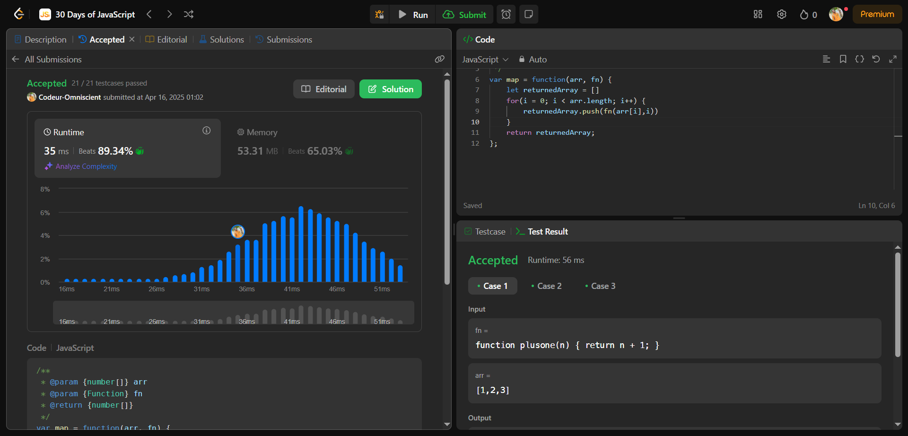

# Array.prototype.map

## Interview Question

Étant donné un tableau d'entiers arr et une fonction de mappage fn, renvoyez un nouveau tableau avec une transformation appliquée à chaque élément.
Le tableau renvoyé doit être créé de telle sorte que returnedArray[i] = fn(arr[i], i).
Veuillez résoudre ce problème sans la méthode Array.map intégrée.

## Resolution Process

### 1 - Problème Posé

Créer une fonction qui parcours un tableau et applique des transformations sur chaque élément du tableau puis renvoi u nouveau tableau sans utiliser la méthode Array.filter

## 2 - C'est quoi Array.filter

Il s'agit d'une méthode natif sur les tableaux en javascript qui crée une nouveau tableau contenant le résultat des transformations effectuer sur chaque élément du tableau

## 3 - Comment ça marche

Cette méthode parcours le tableau, applique la fonction callback qu'il a reçu sur chaque élément du tableau, les ajoute dans un nouveau tableau puis retourne le nouveau tableau.

## 4 - Approche

initialiser un nouveau tableau, parcourir le tableau reçu en paramètre et pour chaque élément du tableau y appliquer la fonction de transformation sur cette élément puis stocker la valeur de retour dans le nouveau tableau à le meme index. Pour ce faire on va utilisé une boucle **for** de préférence afin de parcourir le tableau et y appliquer la fonction.

## Pratique

```js
/**
 * @param {number[]} arr
 * @param {Function} fn
 * @return {number[]}
 */
var map = function (arr, fn) {
  let returnedArray = [];
  for (i = 0; i < arr.length; i++) {
    returnedArray.push(fn(arr[i], i));
  }
  return returnedArray;
};
```

## Résultat


