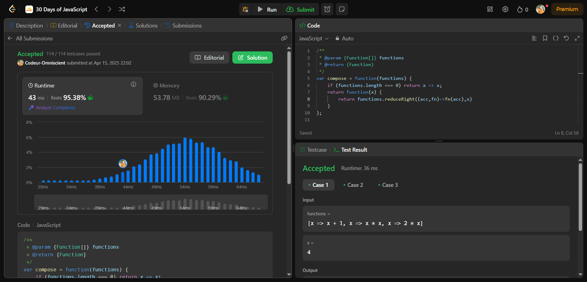

# Fonction Composition

## Interview Question

Étant donné un tableau de fonctions [f1, f2, f3, ..., fn], renvoyer une nouvelle fonction fn qui est la composition fonctionnelle du tableau de fonctions.

## Processus de résolution

### 1 - Problème Posé

Créer une fonction qui prend en paramètre un tableau de fonction et qui retourne une fonction fn qui est la composition fonctionnelle du tableau de fonctions

### 2 - C'est quoi une Fonction Composition

Une **fonction composition** est une fonction qui en combine plusieurs et retourne une seul fonction où la valeur de sortie de la fonction précédente est la valeur d'entrer de la suivante.

### 3 - Comment ça marche

La fonction **compose** qui prend en paramètre le tableau de fonction va appliquer des transformation en commençant par l'extrémité droite vers la gauche.

### 4 - Approche

La fonction compose doit tout d'abord vérifier si le tableau est vide, si oui il retourne une fonction qui renvoi l'élément entré. Si non la fonction compose retourne une fonction qui va renvoyer le résultat de la transformation du tableau de fonction de la droite vers la gauche. Pour se faire on peut utiliser une boucle **for** puis appliquer des transformations de façon décroissante ou utiliser la méthode **reduceRight** qui réduit les éléments du tableau en une seule valeur en allant de la droite vers la gauche.

## Pratique

```js
/**
 * @param {Function[]} functions
 * @return {Function}
 */
var compose = function (functions) {
  if (functions.length === 0) return (x) => x;
  return function (x) {
    return functions.reduceRight((acc, fn) => fn(acc), x);
  };
};
```

## Résultat


