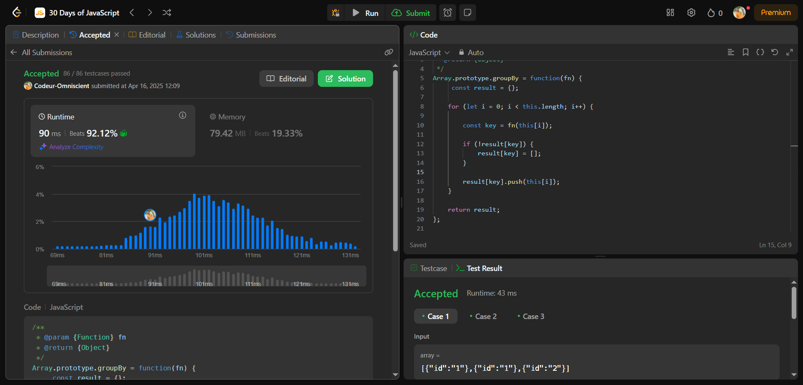

# GroupBy

## Interview Question

Écrivez du code qui optimise tous les tableaux afin que vous puissiez appeler la méthode array.groupBy(fn) sur n'importe quel tableau et qu'elle renvoie une version groupée du tableau.

Un tableau groupé est un objet dont chaque clé est la sortie de fn(arr[i]) et chaque valeur est un tableau contenant tous les éléments du tableau d'origine qui génèrent cette clé.

La fonction de rappel fn fournie acceptera un élément du tableau et renverra une clé de type chaîne.

L'ordre de chaque liste de valeurs doit correspondre à l'ordre d'apparition des éléments dans le tableau. N'importe quel ordre de clés est acceptable.

Veuillez résoudre ce problème sans la fonction \_.groupBy de lodash.

## Processus de résolution

### 1 - Problème Posé

Écrire une fonction qui va récupérer des tableaux puis va retourner une version grouper

### 2 - C'est quoi le Groupby

Cette fonction organise les éléments contenu dans le tableau sur lequel il est appelé en groupe par rapport à un critère donnée.

### 3 - Comment ça marche

Elle prend en paramètre un tableau et retourne la version grouper du tableau où chaque clé est la valeur de retour de la exécuté sur un élément du tableau et chaque valeur est un tableau contenant tous les éléments du tableau d'origine qui génèrent cette clé.

### 4 - Approche

Créer un objet vide result qui servira à stocker les groupes, parcourir chaque élément du tableau avec une boucle for et pour chaque élément, j'applique la fonction de callback fn pour obtenir la clé de regroupement. Si cette clé n'existe pas encore dans l'objet résultat, je crée un tableau vide pour cette clé. J'ajoute l'élément courant au tableau correspondant à sa clé. À la fin, je retourne l'objet contenant tous les groupes.

## Pratique

```js
/**
 * @param {Function} fn
 * @return {Object}
 */
Array.prototype.groupBy = function (fn) {
  const result = {};

  for (let i = 0; i < this.length; i++) {
    const key = fn(this[i]);

    if (!result[key]) {
      result[key] = [];
    }

    result[key].push(this[i]);
  }

  return result;
};
```

## Résultat


