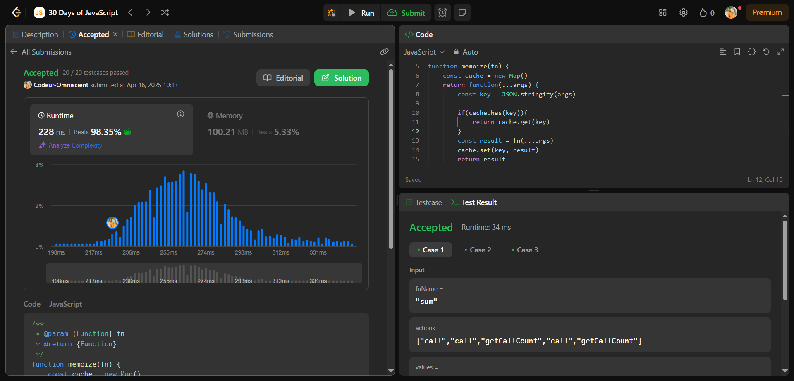

# Memoize

## Interview Question

Étant donné une fonction fn, renvoyez une version mémorisée de cette fonction.

## Resolution Process

### 1 - Problème Posé

Créer une fonction qui prend un fonction **fn** en paramètre et qui retourne la version mémorisée de cette fonction.

### 2 - C'est quoi une fonction mémorisée

Une fonction mémorisée est une fonction qui ne sera jamais appelée deux fois avec les mêmes entrées. Elle renverra plutôt une valeur mise en cache.

### 3 - Comment ça marche

Cette fonction enregistre l'argument le résultat des fonction qui ont été exécutée si l'argument existe dans sa sauvegarde la fonction n'est pas exécuté sinon elle est exécuté et le résultat ainsi que l'argument sont gardé en mémoire

### 4 - Approche

Créer une variable qui va contenir les argument et résultat des fonctions exécutées sous forme de clé valeur. On vérifie si l'argument existe en mémoire, si oui en retourne le résultat sauvegardé en amont si non on exécute la fonction puis enregistre le résultat dans la variable mémoire.

## Pratique

```js
/**
 * @param {Function} fn
 * @return {Function}
 */
function memoize(fn) {
  const cache = new Map();
  return function (...args) {
    const key = JSON.stringify(args);

    if (cache.has(key)) {
      return cache.get(key);
    }
    const result = fn(...args);
    cache.set(key, result);
    return result;
  };
}
```

## Résultat


