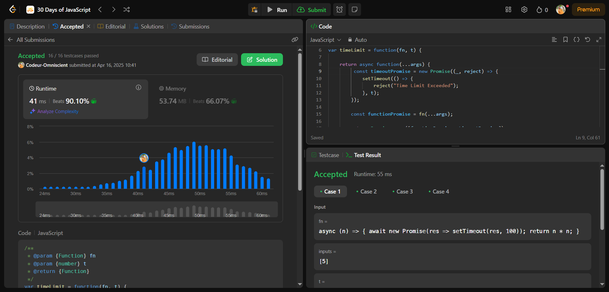

# Promise Time Limit

## Interview Question

Étant donné une fonction asynchrone fn et une durée t en millisecondes, renvoyer une nouvelle version limitée dans le temps de la fonction d'entrée. fn accepte les arguments fournis à la fonction limitée dans le temps.

La fonction limitée dans le temps doit suivre les règles suivantes :

Si la fonction fn se termine dans le délai de t millisecondes, la fonction limitée dans le temps doit résoudre l'exécution avec le résultat.
Si l'exécution de la fonction fn dépasse le délai, la fonction limitée dans le temps doit rejeter l'exécution avec la chaîne « Délai dépassé ».

## Processus de résolution

### 1 - Problème Posé

Créer une fonction qui prend en paramètre une **fonction asynchrone** et un **temps** puis retourne une nouvelle version de la fonction cette fois ci limité dans le temps

### 2 - C'est quoi une promesse limité dans le temps

Une promesse limité dans le temps est une fonction qui retourne un résultat selon le temps qui lui est donnée

### 3 - Comment ça marche

La fonction prend en paramètre une fonction asynchrone et un temps donnée et retourne une nouvelle fonction. Cette nouvelle fonction va effectué une opération concurrente. Si la promesse est résolut dans les temps la fonction retourne la valeur sinon un message d'erreur

### 4 - Approche

Créer deux fonction dans la fonction de retour, une pour la résolution l'autre our le rejet. Renvoyer la fonction qui se termine en première. pour se faire nous pouvons utiliser la fonction **promise.race** qui retourne la promesse résolut en première

## Pratique

```js
/**
 * @param {Function} fn
 * @param {number} t
 * @return {Function}
 */
var timeLimit = function (fn, t) {
  return async function (...args) {
    const timeoutPromise = new Promise((_, reject) => {
      setTimeout(() => {
        reject("Time Limit Exceeded");
      }, t);
    });

    const functionPromise = fn(...args);

    return Promise.race([functionPromise, timeoutPromise]);
  };
};
```

## Résultat


